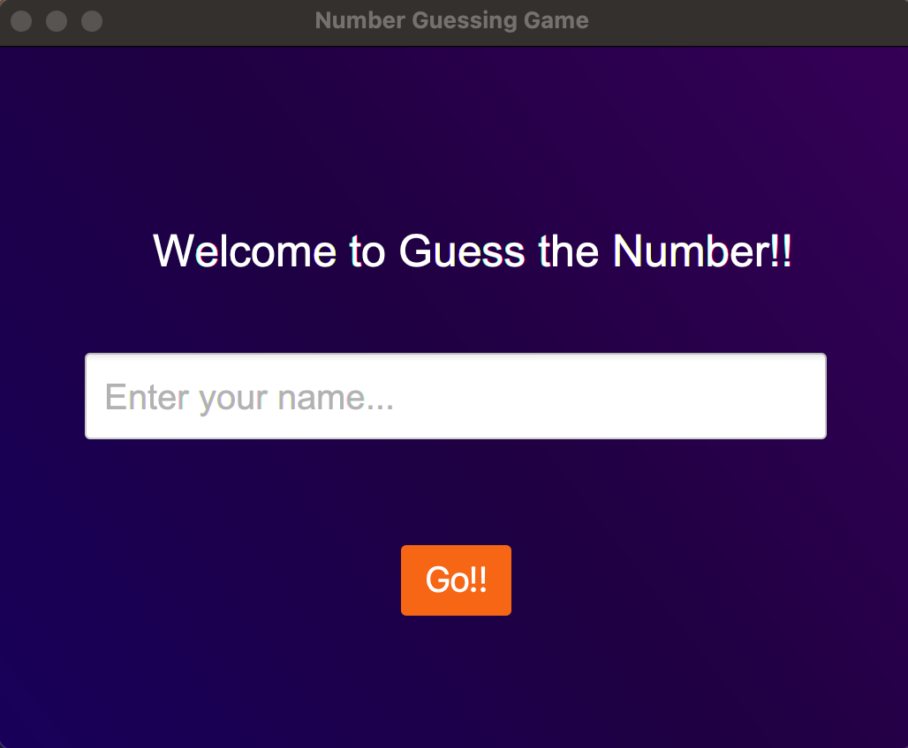
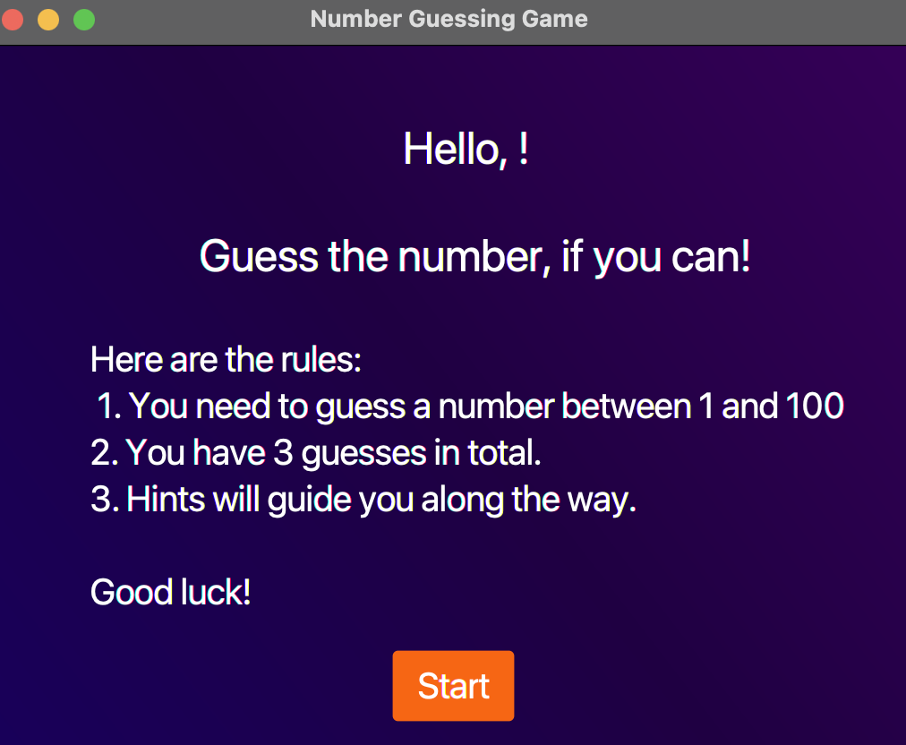
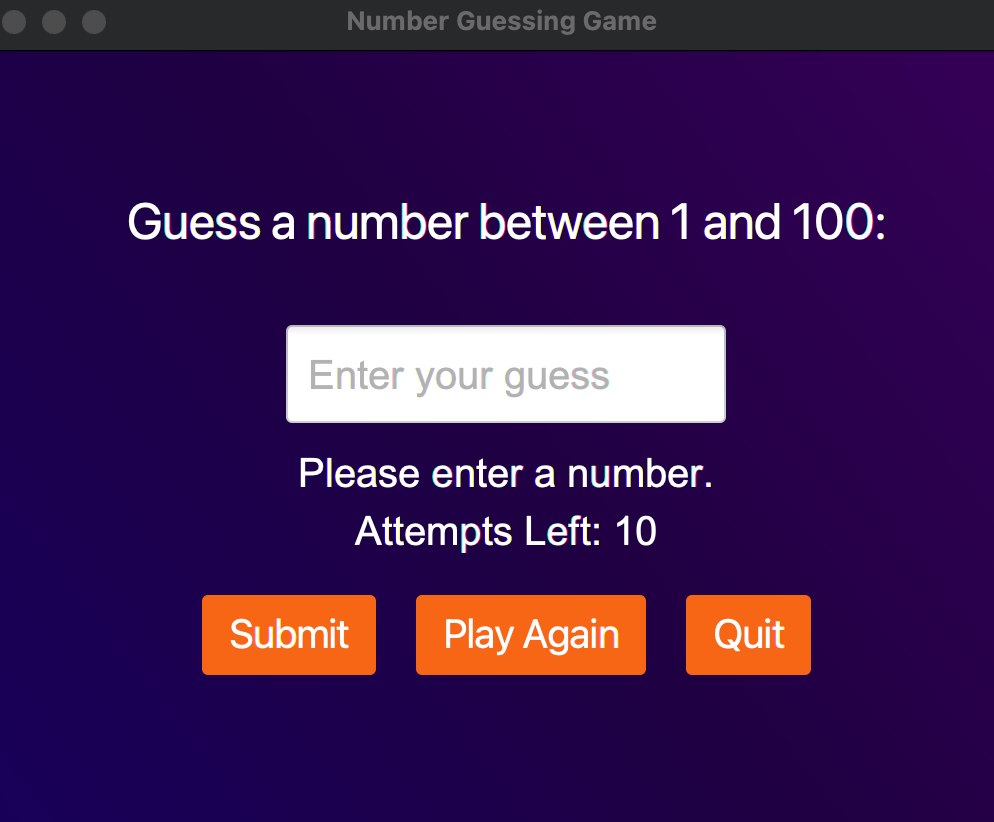
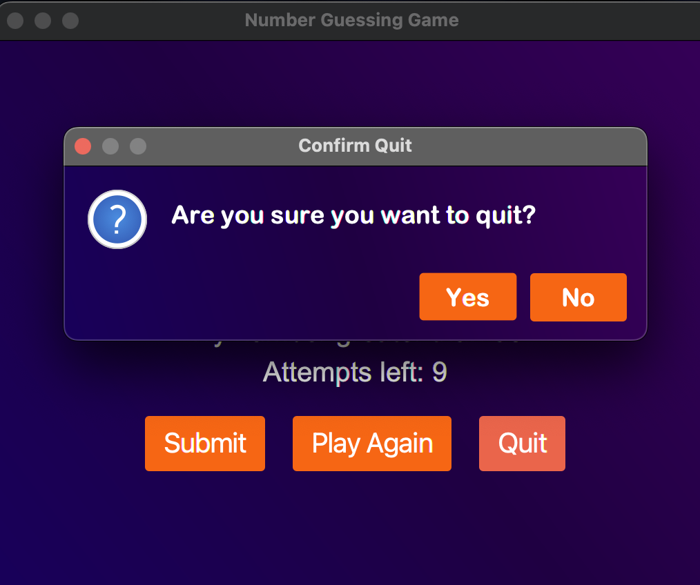

# Guess the Number Game with JavaFX

## Overview
Guess the Number is a simple JavaFX application where players try to guess a randomly generated number. Built with JavaFX, it offers an interactive and enjoyable gaming experience.

## Features
- Allows players to input their name and guess a randomly generated number.
- Provides feedback on each guess, indicating whether the guess is too high or too low.
- Limits the number of attempts per game.
- Displays a congratulatory message upon guessing the correct number or a game over message if the attempts are exhausted.

## Screenshots
### Home Screen

### Rules 

### Game Screen

### Exit Screen

## Dependencies and Libraries Used
- **Java Development Kit (JDK)**: Ensure you have JDK installed on your system.
- **JavaFX SDK**: Download and include the JavaFX SDK in your project's dependencies or build path.

## Setup
1. Make sure you have JDK installed on your system.
2. Download or clone the project repository.
3. Set up your development environment with JavaFX SDK.
4. Open the project in your preferred IDE.
5. Build and run the project.

## License
This project is licensed under the [GNU GPL](LICENSE).

## Contribution
Contributions are welcome! Feel free to open an issue or submit a pull request.
